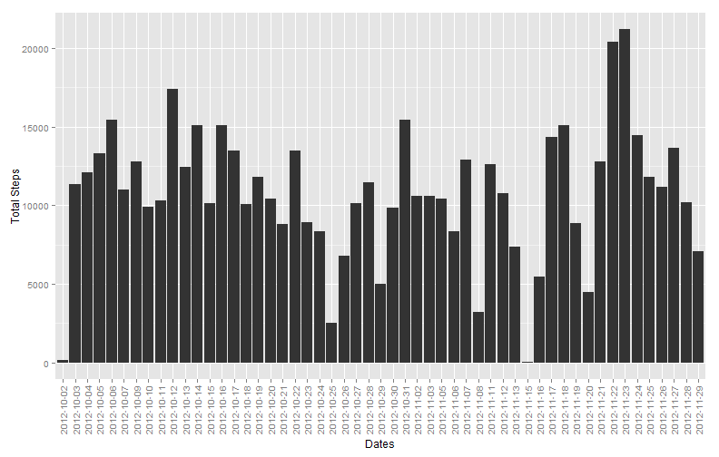
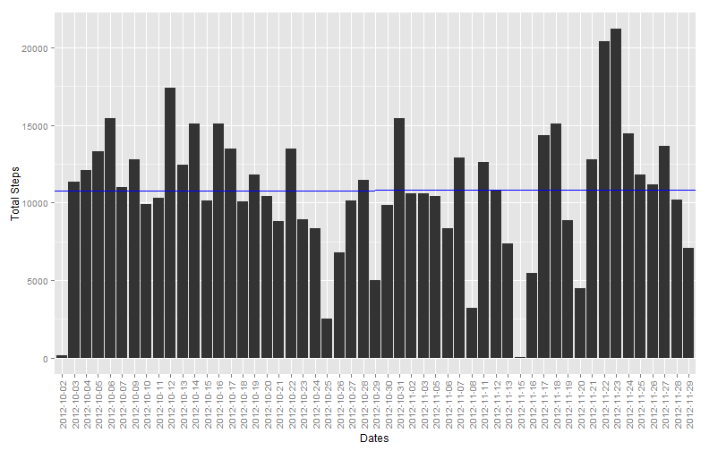
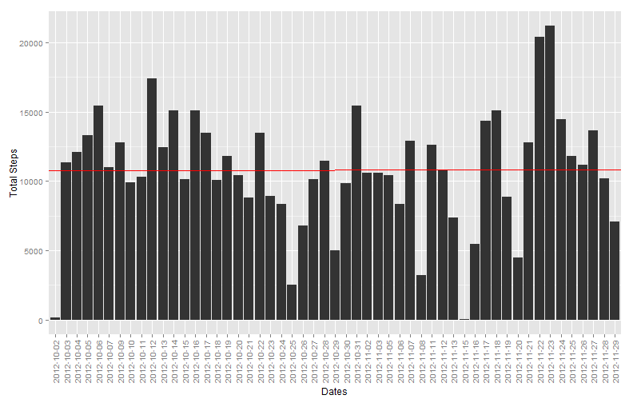
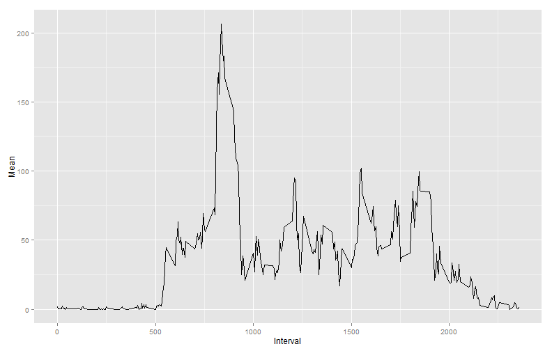
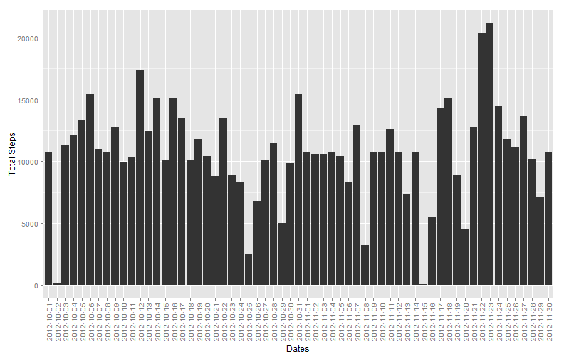
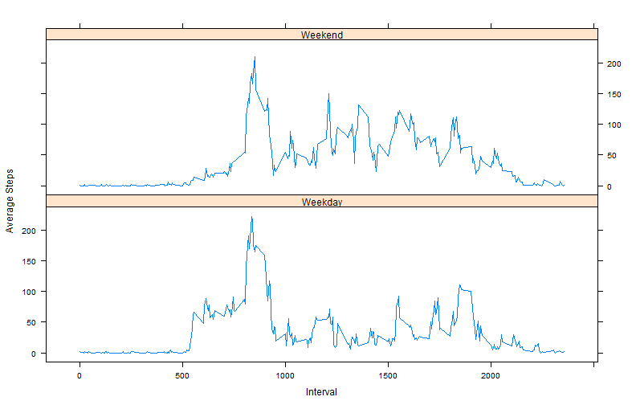

# Reproducible Research: Peer Assessment 1


## Loading and preprocessing the data
###In this part I will load the dataset and create the data frames needed for the analysis

```r
data <- read.csv(file = "activity.csv", header = T, na.strings = "NA")
## New dataset arranged row-wise by interval, column-wise by dates This will
## allow me to easily remove NA values, take averages by interval for the
## daily activity section and replace the NA values by those row means
require(reshape2)
```

```
## Loading required package: reshape2
```

```r
colData <- dcast(data, interval ~ date, value.var = "steps")
```

My hypothesis is that the NA values are limited to whole dates.  Therefore in order to remove NAs, we simple need to remove certain dates from the dataset.  We must then take the sum of the NA values in each column of colData.  If the columns add to 288, we can remove these columns
(288 * 5 minute/interval = 1440 minutes = 1 Day)

```r
colSums(is.na(colData)[, -1])
```

```
## 2012-10-01 2012-10-02 2012-10-03 2012-10-04 2012-10-05 2012-10-06 
##        288          0          0          0          0          0 
## 2012-10-07 2012-10-08 2012-10-09 2012-10-10 2012-10-11 2012-10-12 
##          0        288          0          0          0          0 
## 2012-10-13 2012-10-14 2012-10-15 2012-10-16 2012-10-17 2012-10-18 
##          0          0          0          0          0          0 
## 2012-10-19 2012-10-20 2012-10-21 2012-10-22 2012-10-23 2012-10-24 
##          0          0          0          0          0          0 
## 2012-10-25 2012-10-26 2012-10-27 2012-10-28 2012-10-29 2012-10-30 
##          0          0          0          0          0          0 
## 2012-10-31 2012-11-01 2012-11-02 2012-11-03 2012-11-04 2012-11-05 
##          0        288          0          0        288          0 
## 2012-11-06 2012-11-07 2012-11-08 2012-11-09 2012-11-10 2012-11-11 
##          0          0          0        288        288          0 
## 2012-11-12 2012-11-13 2012-11-14 2012-11-15 2012-11-16 2012-11-17 
##          0          0        288          0          0          0 
## 2012-11-18 2012-11-19 2012-11-20 2012-11-21 2012-11-22 2012-11-23 
##          0          0          0          0          0          0 
## 2012-11-24 2012-11-25 2012-11-26 2012-11-27 2012-11-28 2012-11-29 
##          0          0          0          0          0          0 
## 2012-11-30 
##        288
```

Hypothesis proves TRUE

```r
## This creates a dataset of the dates that have values (noNAs) minus the
## interval column so the interval count does not skew the rowMeans
noNA <- colData[, which(!is.na(colSums(colData)))][, -1]
## This creates a dataset used for the activity pattern without NAs
actPat <- data.frame(interval = colData$interval, mean = rowMeans(noNA))
```

#### The following dataset will be used primarily for the first part of the assignment

```r
## Create date, sum, mean, median vectors
sum <- colSums(noNA)
mean <- colMeans(noNA)
median <- apply(noNA, 2, median)
dateNames <- names(noNA)
## Combine to make final dataframe
smmData <- data.frame(date = dateNames, sum, mean, median)
row.names(smmData) <- NULL
```

## What is mean total number of steps taken per day?
### 1. Make a histogram of the total number of steps taken each day

```r
require(ggplot2)
```

```
## Loading required package: ggplot2
```

```r
dateSum <- ggplot(smmData, aes(date, sum))
dateSum + geom_histogram(stat = "identity") + labs(x = "Dates", y = "Total Steps") + 
    theme(axis.text.x = element_text(angle = 90, vjust = 0.5))
```

 

### 2. Calculate and report the *mean* and *median* total number of steps taken per day
**MEAN**

```r
dateSum + geom_histogram(stat = "identity") + labs(x = "Dates", y = "Total Steps") + 
    theme(axis.text.x = element_text(angle = 90, vjust = 0.5)) + geom_abline(intercept = mean(smmData$sum), 
    colour = "blue")
```

 

```r
mean(smmData$sum)
```

```
## [1] 10766
```

**MEDIAN**

```r
dateSum + geom_histogram(stat = "identity") + labs(x = "Dates", y = "Total Steps") + 
    theme(axis.text.x = element_text(angle = 90, vjust = 0.5)) + geom_abline(intercept = median(smmData$sum), 
    colour = "red")
```

 

```r
median(smmData$sum)
```

```
## [1] 10765
```


## What is the average daily activity pattern?


```r
aPattern <- ggplot(actPat, aes(interval, mean))
aPattern + geom_line() + labs(x = "Interval", y = "Mean")
```

 


## Inputing missing values
### 1. Calculate and report the total number of missing values in the dataset (i.e. the total number of rows with NAs)

```r
length(which(is.na(data$steps)))
```

```
## [1] 2304
```

### 2. Devise a strategy for filling in all of the missing values in the dataset. The strategy does not need to be sophisticated. For example, you could use the mean/median for that day, or the mean for that 5-minute interval, etc.
I have chosen to take the average of the intervals across all the dates taht have values, then apply those averages to the respective intervals of the dates with NAs
### 3. Create a new dataset that is equal to the original dataset but with the missing data filled in.

```r
## Creating dataframe with including the NA dates NA-Date-interval values
## replaced with the interval averages calculated in the actPat dataset
isNA <- colData[, which(is.na(colSums(colData)))]  ## NA dates
naPlaced <- data.frame(actPat$mean, actPat$mean, actPat$mean, actPat$mean, actPat$mean, 
    actPat$mean, actPat$mean, actPat$mean)
names(naPlaced) <- names(isNA)
compData <- cbind(naPlaced, noNA)
compData <- compData[with(compData, order(names(compData)))]
newData <- data.frame(interval = data$interval, date = melt(compData)[, 1], 
    steps = melt(compData)[, 2])
```

### 4. Make a histogram of the total number of steps taken each day and Calculate and report the mean and median total number of steps taken per day. Do these values differ from the estimates from the first part of the assignment? What is the impact of imputing missing data on the estimates of the total daily number of steps?

```r
sumComp <- data.frame(date = names(compData), sum = colSums(compData))
compdateSum <- ggplot(sumComp, aes(date, sum))
compdateSum + geom_histogram(stat = "identity") + labs(x = "Dates", y = "Total Steps") + 
    theme(axis.text.x = element_text(angle = 90, vjust = 0.5))
```

 

**MEAN**

```r
mean(sumComp$sum)
```

```
## [1] 10766
```

**MEDIAN**

```r
median(sumComp$sum)
```

```
## [1] 10766
```

There is no difference in the *mean* calculation, and the difference in the *median* is +1.  Overall, considering the sample range, the differences are negligible. 


## Are there differences in activity patterns between weekdays and weekends?
### 1. Create a new factor variable in the dataset with two levels - "weekday" and "weekend" indicating whether a given date is a weekday or weekend day.

```r
wdnewData <- data.frame(newData, day = weekdays(as.Date(newData$date)), stringsAsFactors = F)
l <- wdnewData$day == "Friday" | wdnewData$day == "Saturday" | wdnewData$day == 
    "Sunday"
wdnewData$day[l] <- "Weekend"
wdnewData$day[!l] <- "Weekday"
wdnewData$day <- as.factor(wdnewData$day)
```


### 2. Make a panel plot containing a time series plot (i.e. type = "l") of the 5-minute interval (x-axis) and the average number of steps taken, averaged across all weekday days or weekend days (y-axis)

```r
require(lattice)
```

```
## Loading required package: lattice
```

```r
finally <- aggregate(wdnewData$step, list(day = wdnewData$day, interval = wdnewData$interval), 
    mean)
names(finally) <- c("day", "interval", "mean.steps")
xyplot(mean.steps ~ interval | day, data = finally, type = "l", xlab = "Interval", 
    ylab = "Average Steps", layout = c(1, 2))
```

 


